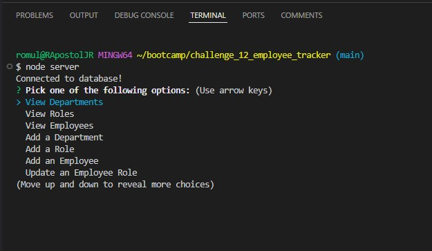
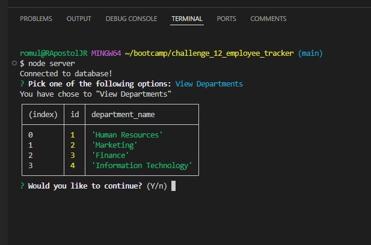
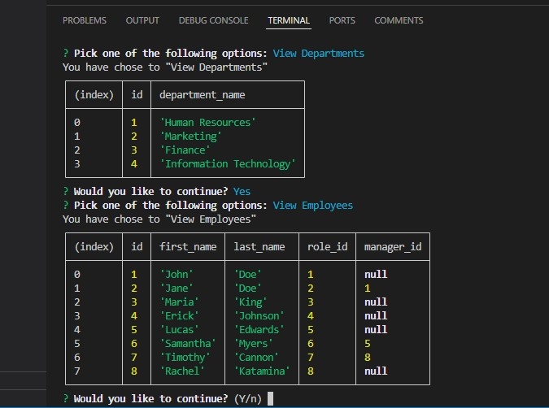

# CHALLENGE 12 EMPLOYEE TRACKER

## DESCRIPTION
This is a simple interface that allows you to keep track of a management database. It's easy accessibility makes it great for users to be able to keep their companies employee database organized. You are able to view all departments, employees, and their roles, as well as adding new departments, roles and employees. You are also able to update an employee and their role.

## HOW TO USE
To use this application, you will first need to have node installed. Once installed, you can enter your terminal and type 'npm install' to install the dependencies in package.json. After that is done, you will need to log in to your mysql account, type 'mysql -u root -p' (if you have a password you will need to leave '-p', if not you can remove '-p'). After loging in run the schema.sql and the seeds.sql files, by typing 'source db/schema.sql' and 'source db/seeds.sql'. You can now exit mysql, and run the application by typing 'node server.js'. You will then be prompted with the following:

If you choose View Departments, a table will be displayed showing all the departments:

If you choose employees, a table will be displayed showing all the employees:

## ACCEPTANCE CRITERIA
GIVEN a command-line application that accepts user input\
WHEN I start the application\
THEN I am presented with the following options: view all departments, view all roles, view all employees, add a department, add a role, add an employee, and update an employee role\
WHEN I choose to view all departments\
THEN I am presented with a formatted table showing department names and department ids\
WHEN I choose to view all roles\
THEN I am presented with the job title, role id, the department that role belongs to, and the salary for that role\
WHEN I choose to view all employees\
THEN I am presented with a formatted table showing employee data, including employee ids, first names, last names, job titles, departments, salaries, and managers that the employees report to\
WHEN I choose to add a department\
THEN I am prompted to enter the name of the department and that department is added to the database\
WHEN I choose to add a role\
THEN I am prompted to enter the name, salary, and department for the role and that role is added to the database\
WHEN I choose to add an employee\
THEN I am prompted to enter the employee’s first name, last name, role, and manager, and that employee is added to the database\
WHEN I choose to update an employee role\
THEN I am prompted to select an employee to update and their new role and this information is updated in the database

## VIEWING MY PROJECT
Link to GitHub: <i> https://github.com/rapostoljr/challenge_12_employee_tracker.git </i>\
Videon link: <i> ENTER VIDEO LINK HERE </i>